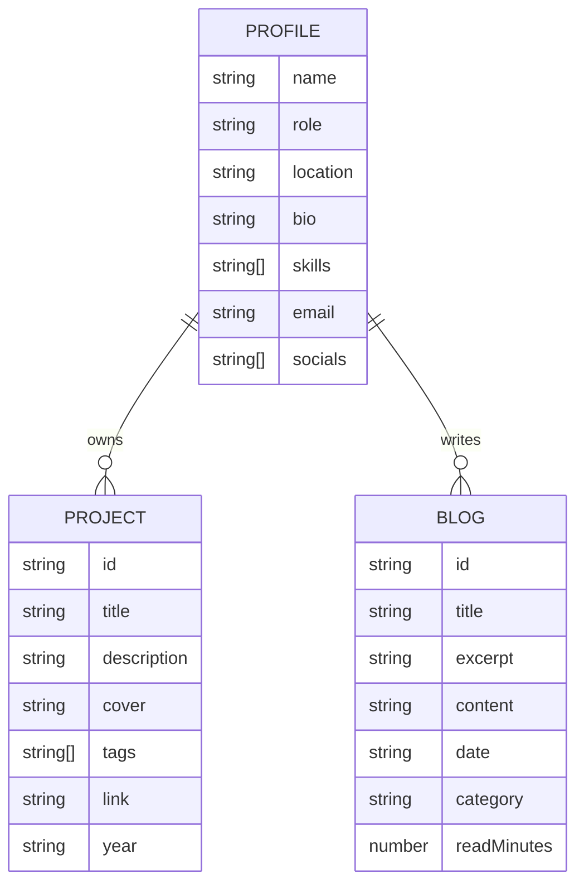

## 1. 架构设计

```mermaid
flowchart TD
    subgraph "前端层"
        "React 18 + Vite" --> "Tailwind CSS 3"
        "React 18 + Vite" --> "Motion (动效)"
        "React 18 + Vite" --> "React Router"
    end
    subgraph "数据层"
        "本地数据文件" --> "blogs.ts"
        "本地数据文件" --> "projects.ts"
        "本地数据文件" --> "profile.ts"
    end
    subgraph "构建与部署"
        "Vite Build" --> "静态资源"
        "静态资源" --> "本地预览 / 部署"
    end
    "前端层" --> "数据层"
    "前端层" --> "构建与部署"
```

## 2. 技术说明

- **前端**：React 18 + TypeScript + Vite 5
- **样式**：Tailwind CSS 3 + CSS 变量（颜色/字体令牌）
- **动效**：Motion（原 Framer Motion）用于 Hero 进入与滚动揭示；轻量交互用 CSS
- **路由**：React Router 6（首页 + 博客详情弹层共用 `/`，弹层状态用 query 控制）
- **字体**：通过 `@fontsource` 本地化加载 Fraunces、Newsreader、JetBrains Mono
- **后端**：无（纯静态）
- **数据库**：无；数据使用 TS 模块导出常量

## 3. 路由定义

| 路由 | 用途 |
|------|------|
| `/` | 首页：Hero / 关于 / 精选项目 / 最近博客 / 联系方式 |
| `/?blog=<id>` | 首页 + 打开指定博客的阅读视图弹层 |

## 4. 目录结构

```
src/
├── components/
│   ├── Hero.tsx
│   ├── About.tsx
│   ├── Projects.tsx
│   ├── Blog.tsx
│   ├── Contact.tsx
│   ├── Nav.tsx
│   ├── Footer.tsx
│   └── BlogReader.tsx       # 阅读弹层
├── data/
│   ├── profile.ts
│   ├── projects.ts
│   └── blogs.ts             # 10 条博客
├── hooks/
│   └── useReveal.ts         # IntersectionObserver 封装
├── styles/
│   └── global.css           # 字体/变量/纹理
├── App.tsx
└── main.tsx
```

## 5. 数据模型



## 6. 设计令牌（CSS 变量）

```css
:root {
  --color-bg: #F4EFE6;
  --color-ink: #1F1B16;
  --color-ink-soft: #5A5147;
  --color-accent: #8B3A2E;
  --color-gold: #B8956A;
  --color-line: #D9D0C2;
  --font-display: 'Fraunces', serif;
  --font-body: 'Newsreader', serif;
  --font-mono: 'JetBrains Mono', monospace;
}
```

## 7. 性能与无障碍

- 字体使用 `font-display: swap` 与子集化加载
- 图片懒加载（`loading="lazy"`），首屏 Hero 不超过 1 张图
- 焦点可见、键盘可关闭弹层（Esc）、ARIA 标签
- 章节锚点跳转支持键盘导航
